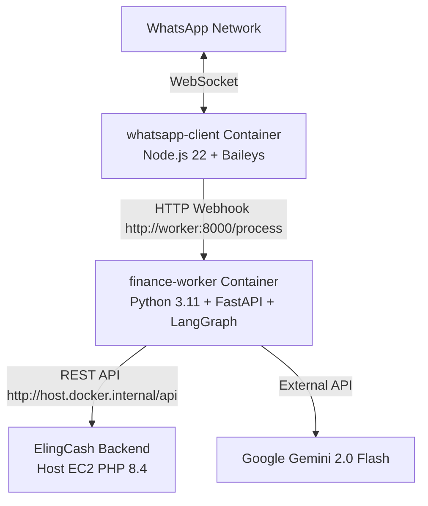

# 🐳 Deployment, Docker & Troubleshooting Guide — `finance-agent`

Dokumen ini berisi rangkuman arsitektur Docker Compose, panduan pengoperasian container, integrasi API ke ElingCash, serta langkah-langkah *troubleshooting* untuk aplikasi **WhatsApp AI Agent (`finance-agent`)**.

---

## 🏗️ Arsitektur Container Docker

Aplikasi `finance-agent` berjalan menggunakan Docker Compose yang terdiri dari dua service utama:



| Container Service | Container Name | Technology | Port | Function |
| :--- | :--- | :--- | :--- | :--- |
| `worker` | `finance-worker` | Python 3.11, FastAPI, LangGraph | `8000:8000` | Memproses NLP/AI prompt Gemini & transaksi ElingCash |
| `client` | `whatsapp-client` | Node.js 22, Baileys WebSocket | - | Mengurus koneksi WhatsApp Web, QR scan, & webhook |

---

## ⚙️ Konfigurasi Environment (`.env`)

File `.env` di folder `/home/ubuntu/finance-agent/.env` berisi:

```env
GOOGLE_API_KEY=your_gemini_api_key
AI_MODEL_NAME=gemini-2.0-flash
FINSIGHT_BASE_URL=http://host.docker.internal/api
FINSIGHT_TOKEN=your_sanctum_personal_access_token
```

> **Catatan `host.docker.internal`**: Dikonfigurasi via `extra_hosts` di `docker-compose.yml` agar container `finance-worker` dapat langsung memanggil API `cashflow-assistant` (ElingCash) yang berjalan secara *native* di host EC2 tanpa melalui public internet.

---

## 🐳 Panduan Penggunaan Docker Commands

Jalankan perintah berikut di direktori `/home/ubuntu/finance-agent`:

### 1. **Mengecek Status Container**
```bash
sudo docker compose ps
```

### 2. **Melihat Log Container secara Real-time**
* **Log WhatsApp Client (QR Code / Chat Log)**:
  ```bash
  sudo docker logs -f --tail 100 whatsapp-client
  ```
* **Log FastAPI Worker (AI Processing & API Calls)**:
  ```bash
  sudo docker logs -f --tail 100 finance-worker
  ```
* **Log Gabungan Semua Container**:
  ```bash
  sudo docker compose logs -f
  ```

### 3. **Restart Container**
* Restart seluruh service:
  ```bash
  sudo docker compose restart
  ```
* Restart service WhatsApp Client saja:
  ```bash
  sudo docker compose restart client
  ```
* Restart service Worker AI saja:
  ```bash
  sudo docker compose restart worker
  ```

### 4. **Re-build Container setelah Update Kode**
Jika ada pembaruan kode di repositori `finance-agent`:
```bash
git pull origin main
sudo docker compose up -d --build
```

---

## 🛠️ Troubleshooting Guide

### 1. **Koneksi WhatsApp Terputus / Perlu Re-Scan QR Code**
* **Gejala**: Bot WhatsApp tidak merespons pesan atau status di log menunjukkan `Connection Closed`.
* **Penyebab**: Sesi WhatsApp terputus atau dikeluarkannya perangkat dari HP.
* **Solusi**:
  1. Hapus session auth lama:
     ```bash
     sudo rm -rf client/auth_info_baileys/*
     ```
  2. Restart container client:
     ```bash
     sudo docker compose restart client
     ```
  3. Tampilkan log QR Code baru dan scan dari HP:
     ```bash
     sudo docker logs -f whatsapp-client
     ```

### 2. **Worker AI Gagal Terhubung ke API ElingCash (`host.docker.internal`)**
* **Gejala**: Log worker menampilkan `401 Unauthorized` atau `Connection Refused`.
* **Penyebab**: Sanctum Token kadaluarsa/salah, atau Nginx belum aktif.
* **Solusi**:
  1. Tes apakah API ElingCash dapat diakses dari host:
     ```bash
     curl -I http://localhost/api
     ```
  2. Generate Sanctum token baru jika perlu:
     ```bash
     cd /var/www/cashflow-assistant/production
     php artisan tinker --execute='$u = App\Models\User::first(); echo $u->createToken("agent")->plainTextToken;'
     ```
  3. Update token di `/home/ubuntu/finance-agent/.env` dan restart worker:
     ```bash
     sudo docker compose restart worker
     ```

### 3. **API Key Gemini Error / Exceeded Rate Limit**
* **Gejala**: Worker merespons error saat memproses kalimat keuangan.
* **Solusi**: Periksa keabsahan `GOOGLE_API_KEY` di `/home/ubuntu/finance-agent/.env` dan pastikan API Key aktif di Google AI Studio.

### 4. **Container Kehabisan Resource (RAM OOM)**
* **Gejala**: Container restart berulang kali (`CrashLoopBackOff`).
* **Solusi**: Cek penggunaan memori container:
  ```bash
  sudo docker stats
  ```
  Pastikan Swap 4GB di EC2 tetap aktif (`free -h`).
